cs4.9下载链接：https://share.weiyun.com/K4zYT2Ty 密码：2qux2g

# 服务端

1.下载完成之后上传centos服务器，只要是Linux服务器就可以

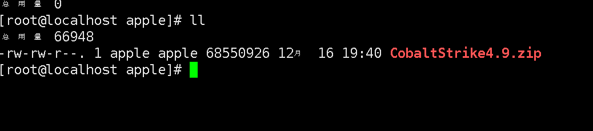 

2. 初始状态他是红色的，就是他没有执行权限
   1. 授权cs =》==chmod +x CobaltStrike4.9.zip==。他就变绿色
   2. unzip CobaltStrike4.9.zip解压

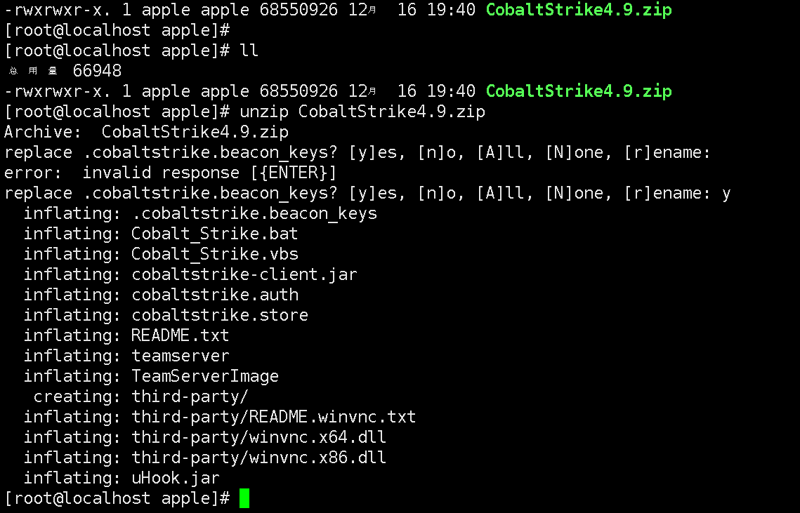 

3. 这两个文件给执行权限

 

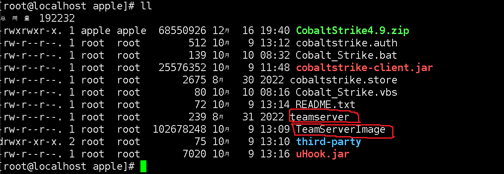 

4. 执行teamserver，查看linux服务器ip地址

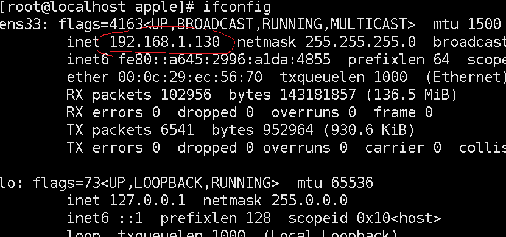 

```sh
./teamserver 192.168.1.130 user
# 192.168.1.130。就是Linux服务器地址
# user就是密码，可以随意更改
```

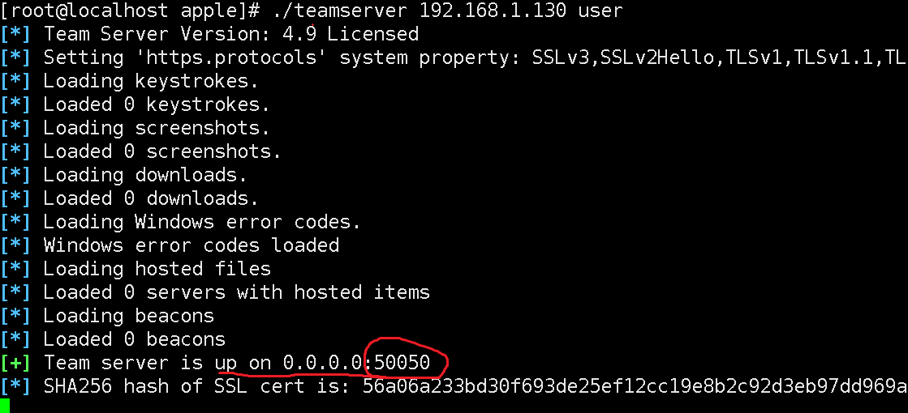 

> 这是端口


# 客户端

> 服务端和客户端都是同一个`cobaltstrike4.9.zip`

1. 双击.vbs
   1. alias：不用修改
   2. host：就是服务端ip地址
   3. port：就是端口
   4. password：就是密码

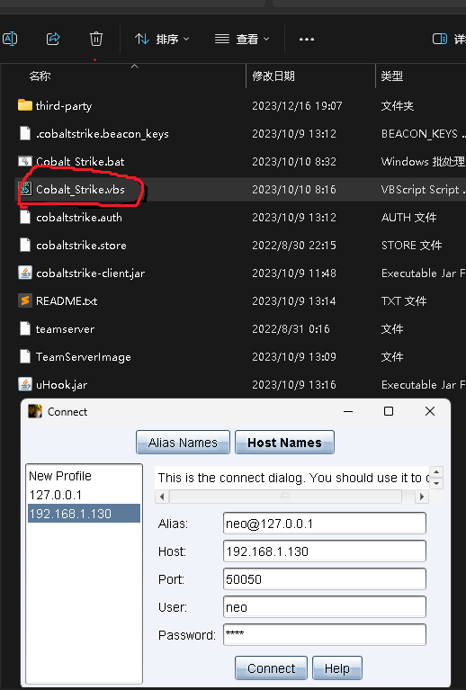 


2. 链接成功

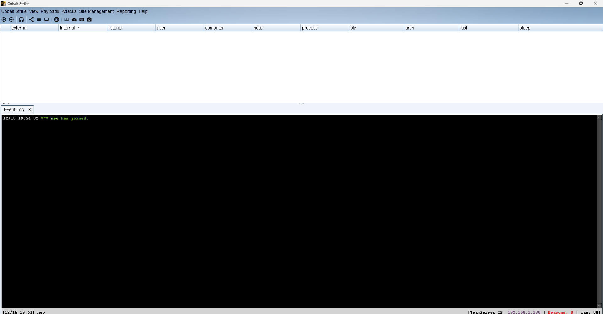 


# 创建监听器

- 菜单栏是不是有一个耳机图片，点他

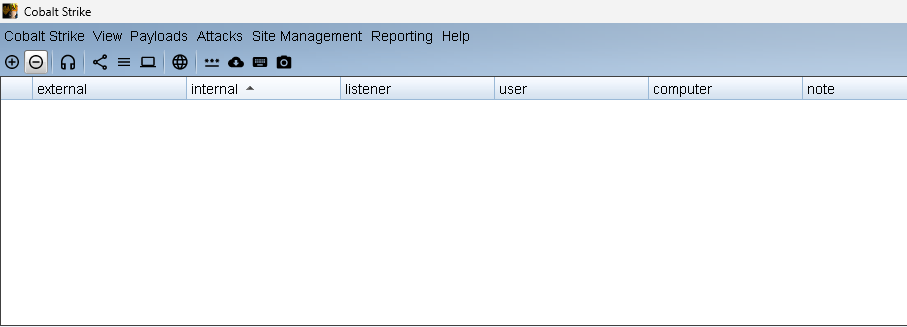 

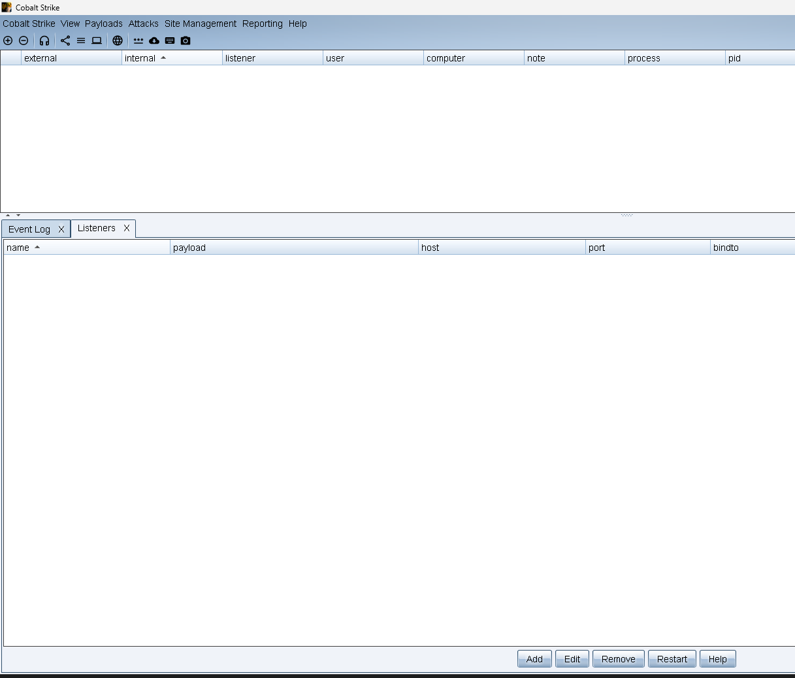

> 点Add

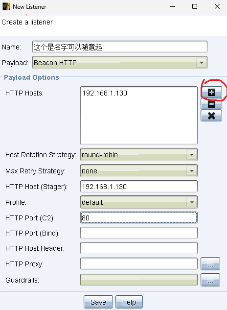 

- 创建成功

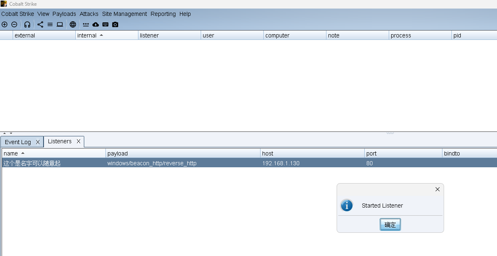 


